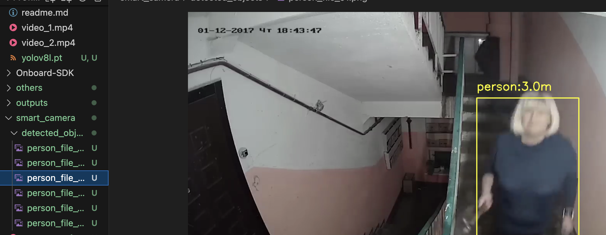

# Smart spy camera (YOLOv8)


## Idea
The technology for introducing artificial intelligence into surveillance cameras is just beginning to develop. This mini-project is one of the options for such development. It is designed to track people on video, determining the distance from them and from the camera using the focal length formula. In addition, every ten seconds, when the model detects a person, the program takes a screenshot and saves it in a folder.

Not the worst solution to spy on your apartment neighbors😁.

## Programm 
The program uses the basic YOLOv8l model, configured only to detect people.

This way programm calculates focal length of the object:

 ```bash
    𝑓 = (𝑃 ⋅𝐷) / 𝑊
 ```
And destination of the object from the cameras coordinates. 

 ```bash
    𝐷 = (𝑊 ⋅𝑓) / 𝑃
 ```

Where:

𝑓 - focal length 

𝑃 - object width in pixels 

𝐷 - real destination

𝑊 - real width of the object

Program aslo takes pictures every 10 seconds of humans detection and saves photos to specified folder. 



## Authors:
- Kucher Maks (maxim.kucher2005@gmail.com)


